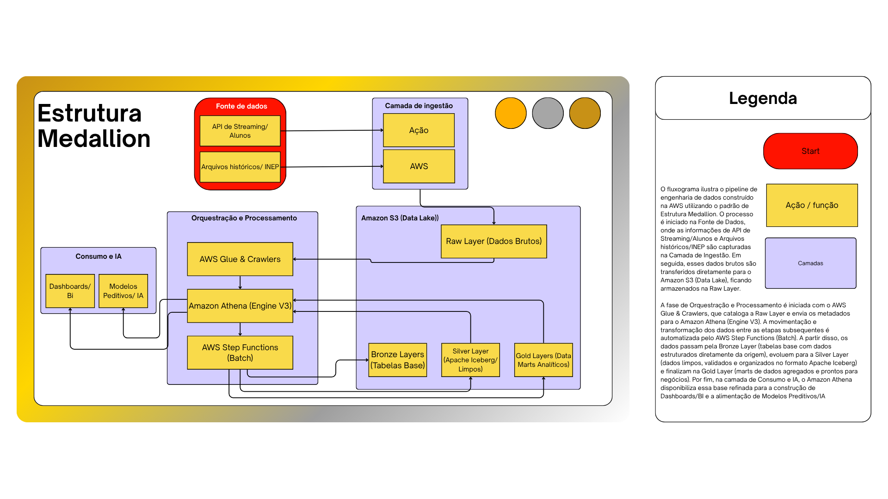

# 📊 Tech Challenge - Fase 2: Pipeline Híbrido de Dados Educacionais

## 1. Contexto do Problema
A alfabetização na infância é um pilar fundamental para o desenvolvimento educacional, social e econômico do Brasil. Alinhado ao **Compromisso Nacional Criança Alfabetizada**, este projeto analisa o Indicador Criança Alfabetizada, focado no ponto de corte de 743 pontos na escala de proficiência do Saeb, para monitorar a meta de garantir que todas as crianças brasileiras estejam alfabetizadas até o final do 2º ano do ensino fundamental. 

Para compreender as desigualdades educacionais e subsidiar políticas públicas baseadas em evidências, construímos um Data Lakehouse que integra microdados educacionais, metas nacionais/estaduais/municipais e indicadores de desempenho extraídos da **Base dos Dados**.

---

## 2. Arquitetura da Solução
A solução foi desenvolvida na **AWS** seguindo o paradigma **Data Lakehouse** (Arquitetura Medalhão) e um fluxo **Híbrido (Batch + Streaming)**.

* **Ingestão Batch:** Extração periódica de dados históricos (metas educacionais, dados de municípios e resultados agregados), armazenados inicialmente na camada RAW.
* **Ingestão Streaming (Micro-batching):** Simulação de recepção de eventos em tempo quase real (microdados de alunos) via API Gateway e AWS Lambda, salvando arquivos JSON diretamente na camada Bronze.
* **Camada Bronze (Raw Data):** Armazenamento de dados brutos sem transformações significativas, preservando o histórico completo.
* **Camada Silver (Dados Tratados):** Limpeza, padronização de tipos e nomes, detecção de valores ausentes e normalização das chaves de relacionamento.
* **Camada Gold (Camada Analítica):** Consolidação dos dados utilizando o formato Apache Iceberg para garantir operações transacionais, servindo como base estrutural para a criação dos Data Marts finais (evolução temporal do indicador, comparação entre metas e resultados, e indicadores por município).



---

## 3. Tecnologias Utilizadas e Justificativas
* **AWS S3:** Armazenamento resiliente e de baixo custo para as camadas do Data Lake.
* **Amazon Athena (Engine V3) + Apache Iceberg:** Motor de query *serverless* que possibilita governança e operações transacionais (como `MERGE INTO`), unificando o fluxo batch e streaming sem gerar duplicidade.
* **AWS Step Functions:** Orquestrador *serverless* utilizado para sequenciar a execução do pipeline (Bronze -> Silver -> Gold).
* **AWS Lambda & API Gateway:** Utilizados para construir a rota de ingestão de streaming de forma leve, sem necessidade de instanciar clusters complexos.
* **Python:** Para estruturação dos simuladores locais e processamento de funções Lambda.

---

## 4. Decisões Arquiteturais e Trade-offs
* **Batch vs. Streaming:** Optou-se por um modelo híbrido. Dados de metas anuais rodam em rotinas Batch (baixo custo). Já o envio de informações de alunos exigia menor latência, justificando a adoção de streaming via API. 
* **Data Lake vs. Data Warehouse:** Escolhemos um Data Lakehouse (S3 + Iceberg) ao invés de um DW tradicional (como Redshift) para reduzir drasticamente os custos de armazenamento, mantendo a performance de consulta.
* **Custo vs. Performance:** Todo o ecossistema é *Serverless*. Não há servidores ociosos gerando custos; paga-se apenas pelo tempo de execução e volume de dados escaneados.

---

## 5. Qualidade de Dados e Governança
Implementamos rotinas rigorosas de validação:
* **Validações Blocker:** Verificação de duplicidade, validação de chaves de relacionamento (municípios/órfãos) e consistência entre tabelas (valores percentuais válidos entre 0 e 100).
* **Monitoramento e Alertas:** Rastreamento proativo de regras de negócio, como a sinalização (INFO) da indisponibilidade do detalhamento de níveis de proficiência no ano de 2023.
* **Governança de Código:** Versionamento rigoroso via Git Flow, com separação de *branches* (`feat/...`), uso de Pull Requests e histórico de commits rastreáveis.

---

## 6. FinOps e Otimização de Custos

Nossa arquitetura foi desenhada com foco em eficiência financeira e controle de recursos. As principais decisões técnicas que reduziram o custo da nossa infraestrutura foram:

* **Uso Eficiente de Armazenamento:** A conversão de JSON/CSV para o formato **Parquet** na camada Silver reduz o volume de dados em até 80%, diminuindo drasticamente a fatura de queries do Amazon Athena.
* **Otimização de Queries:** O particionamento dos dados no Iceberg e a execução transacional (`MERGE INTO`) evitam o reprocessamento custoso de tabelas completas, garantindo que o Athena escaneie apenas o necessário.
* **Rastreabilidade por Tagueamento:** Implementamos tags padronizadas em todos os recursos AWS (S3, Lambda, Step Functions e Athena). Isso garante rastreabilidade da origem dos dados e permite a visão granular dos custos por componente do pipeline.

### Estimativa de Custos do Pipeline

Para chegar nessa estimativa, cruzamos o volume real que geramos no nosso bucket S3 durante os testes (cerca de 434 MB) com a tabela de preços da AWS. O maior ganho financeiro da nossa solução é não ter servidores ociosos (como EC2 ou EMR) ligados 24/7. Sendo 100% *serverless*, pagamos apenas pelos segundos de execução.

| Recurso AWS | Volume Mensal Estimado | Custo Estimado | Como Calculamos / Justificativa |
| :--- | :--- | :--- | :--- |
| **S3 (Storage)** | ~ 450 MB | $ 0,00 | Muito abaixo do limite de 5 GB do Free Tier da AWS. |
| **Athena (Consultas)** | ~ 5 GB escaneados | < $ 0,05 | A AWS cobra US$ 5,00 por Terabyte. Graças ao formato Parquet/Iceberg, os escaneamentos ficam na casa de MBs. |
| **Glue (Crawlers)** | 30 execuções curtas | $ 0,00 | Coberto pelo limite de 1 milhão de minutos gratuitos do Glue. |
| **Step Functions** | ~ 1.000 transições | $ 0,00 | O Free Tier cobre até 4.000 transições de estado por mês. |
| **Lambda & API Gateway** | ~ 10.000 requisições | $ 0,00 | O limite gratuito atende até 1 milhão de chamadas mensais. |
| **Total Mensal** | **Cenário do Projeto** | **Centavos** | **Totalmente absorvido pelo Free Tier da AWS.** |

---

## 7. Aplicação em Inteligência Artificial
A camada Gold foi consolidada em Views Semânticas (`vw_ia_alfabetizacao`) preparadas para algoritmos preditivos e dashboards:
* **Modelos de Predição de Alfabetização:** Com o histórico de resultados e o *gap* em relação às metas, é possível treinar modelos de regressão para prever quais municípios têm maior risco de não atingir os objetivos até 2030.
* **Análise de Desigualdade Educacional:** Algoritmos de *clustering* podem agrupar municípios com perfis semelhantes de vulnerabilidade com base nas taxas de participação e níveis socioeconômicos, direcionando políticas públicas.

---

## 8. Guia de Implantação (Faça Você Mesmo)

Siga o passo a passo abaixo para replicar a infraestrutura e executar o pipeline na sua conta AWS:

> ⚠️ **Aviso Importante:** Para que esse processo funcione, é necessário possuir um *Billing ID* do Google Cloud (BigQuery) configurado para a extração inicial dos dados, executada no script `src/00_ingestao_raw/01_extracao_dados.py`.

1. **Autenticação AWS:** Configure o AWS CLI no seu terminal local para garantir que os scripts de deploy tenham as credenciais e permissões necessárias.

2. **Estrutura do S3:** Execute o comando `python infraestrutura/01_setup_pastas_s3.py` no seu terminal para provisionar o bucket e criar as pastas base (RAW, Bronze, Silver, Gold).

3. **Catálogo de Dados:** Crie o AWS Glue Crawler responsável por mapear os arquivos da raw executando o comando `python infraestrutura/02_setup_glue_crawler.py`.

4. **Orquestração Bronze:** Configure o trigger do EventBridge e a máquina de estado importando os arquivos `infraestrutura/03_eventbridge_rule.json` e `infraestrutura/04_step_function_pipeline_bronze.json` no console da AWS.
   > ⚠️ **Atenção:** Ao configurar as consultas do Athena neste passo, é obrigatório definir o *Output Location* (pasta de resultados no S3) corretamente.

5. **Tabelas Bronze:** Execute o script `infraestrutura/05_setup_tabelas_bronze.sql` diretamente no console do Amazon Athena para instanciar a estrutura base da primeira camada.

6. **Orquestração Silver:** Crie a máquina de estados da camada Silver importando o arquivo `infraestrutura/06_step_function_pipeline_silver.json`.

7. **Jobs da Camada Silver:** Crie os jobs no AWS Glue utilizando todos os scripts Python de tratamento de dados listados na pasta `src/02_camada_silver/`.

8. **Jobs de Dimensões:** Crie os jobs específicos responsáveis pelo processamento das dimensões utilizando os scripts `src/01_camada_bronze/08_bronze_dimensoes.py` e `src/02_camada_silver/09_silver_dimensoes.py`.

9. **Workflow do Glue:** Configure o AWS Glue Workflow para amarrar e orquestrar as execuções dos jobs recém-criados.

10. **Orquestração Gold:** Crie a máquina de estados final importando o arquivo `infraestrutura/07_step_function_pipeline_gold.json`.
    > ⚠️ **Atenção:** Você precisará alterar manualmente os ARNs genéricos nos arquivos JSON das Step Functions (Silver e Gold) pelos ARNs reais dos Jobs gerados na sua conta.

11. **Configurações Gold (Data Marts):** Aplique as regras da camada analítica rodando o script `infraestrutura/08_setup_tabelas_gold.sql` no console do Athena.

12. **Ingestão Streaming (Tempo Real):** Configure uma função AWS Lambda utilizando o código `src/05_streaming/02_ingestao_streaming_raw.py` e crie um gatilho via API Gateway. Para injetar os dados de teste na arquitetura, rode localmente o simulador com o comando `python src/05_streaming/01_simulador_api.py`.

> 💡 **Nota sobre o Streaming:** Como o foco principal desta PoC foi validar a ponta a ponta da arquitetura e a ingestão assíncrona, focamos o streaming em alimentar a camada de entrada (Bronze). Se fôssemos escalar isso para um ambiente de produção real onde a empresa precisa das métricas batendo em tempo real nas outras camadas, o caminho seria:
> 
> * **Na Silver:** Usar um motor de streaming contínuo (como o Structured Streaming no Spark via Glue) para limpar, padronizar e remover duplicatas dos eventos assim que eles chegam.
> * **Na Gold:** Fazer atualizações incrementais nas tabelas usando o `MERGE` do Iceberg, garantindo que os painéis analíticos atualizem os dados na mesma hora, sem precisar rodar aquele lote pesado do zero.

---

## Estrutura do Repositório
```text
📦 tech-challenge-fase2-alfabetizacao
 ┣ 📂 .github
 ┃ ┗ 📜 pull_request_template.md
 ┣ 📂 assets
 ┃ ┣ 📜 arquitetura.png
 ┃ ┣ 📜 execucoes_crawler_raw.png
 ┃ ┣ 📜 execucoes_crawler_silver.png
 ┃ ┣ 📜 ingestao_bronze_execucoes.png
 ┃ ┣ 📜 ingestao_bronze_grafico_exec.png
 ┃ ┣ 📜 ingestao_gold_execucoes.png
 ┃ ┣ 📜 ingestao_gold_grafico_exec.png 
 ┃ ┣ 📜 ingestao_silver_execucoes.png
 ┃ ┣ 📜 ingestao_silver_grafico_exec.png 
 ┃ ┗ 📜 streaming_dados_s3.png
 ┣ 📂 data
 ┃ ┗ 📂 amostras
 ┃   ┗ 📜 alunos_streaming.csv
 ┣ 📂 infraestrutura
 ┃ ┣ 📜 01_setup_pastas_s3.py
 ┃ ┣ 📜 02_setup_glue_crawler.py
 ┃ ┣ 📜 03_eventbridge_rule.json
 ┃ ┣ 📜 04_step_function_pipeline_bronze.json
 ┃ ┣ 📜 05_setup_tabelas_bronze.sql
 ┃ ┣ 📜 06_step_function_pipeline_silver.json
 ┃ ┣ 📜 07_step_function_pipeline_gold.json
 ┃ ┣ 📜 08_setup_tabelas_gold.sql
 ┃ ┗ 📜 09_criar_marts.sql
 ┣ 📂 src
 ┃ ┣ 📂 00_ingestao_raw
 ┃ ┃ ┗ 📜 01_extracao_dados.py
 ┃ ┣ 📂 01_camada_bronze
 ┃ ┃ ┣ 📜 01_insert_dicionario.sql
 ┃ ┃ ┣ 📜 02_insert_uf.sql
 ┃ ┃ ┣ 📜 03_insert_municipio.sql
 ┃ ┃ ┣ 📜 04_insert_meta_alfabetizacao_brasil.sql
 ┃ ┃ ┣ 📜 05_insert_meta_alfabetizacao_uf.sql
 ┃ ┃ ┣ 📜 06_insert_meta_alfabetizacao_municipio.sql
 ┃ ┃ ┣ 📜 07_insert_alunos.sql
 ┃ ┃ ┗ 📜 08_bronze_dimensoes.py
 ┃ ┣ 📂 02_camada_silver
 ┃ ┃ ┣ 📜 01_silver_dicionario.py
 ┃ ┃ ┣ 📜 02_silver_uf.py
 ┃ ┃ ┣ 📜 03_silver_municipio.py
 ┃ ┃ ┣ 📜 04_silver_meta_brasil.py
 ┃ ┃ ┣ 📜 05_silver_meta_municipio.py
 ┃ ┃ ┣ 📜 06_silver_meta_uf.py
 ┃ ┃ ┣ 📜 07_silver_alunos.py
 ┃ ┃ ┗ 📜 09_silver_dimensoes.py
 ┃ ┣ 📂 03_camada_gold
 ┃ ┃ ┣ 📜 01_merge_dim_geografia.sql
 ┃ ┃ ┣ 📜 02_merge_dim_rede.sql
 ┃ ┃ ┣ 📜 03_merge_dim_serie.sql
 ┃ ┃ ┣ 📜 04_merge_fato_resultados.sql
 ┃ ┃ ┣ 📜 05_merge_fato_metas.sql
 ┃ ┃ ┗ 📜 06_merge_fato_cobertura.sql
 ┃ ┣ 📂 04_qualidade_dados
 ┃ ┃ ┣ 📜 01_quality_check_silver.sql
 ┃ ┃ ┗ 📜 02_quality_check_gold.sql
 ┃ ┗ 📂 05_streaming
 ┃   ┣ 📜 01_simulador_api.py
 ┃   ┗ 📜 02_ingestao_streaming_raw.py
 ┣ 📜 .gitignore
 ┣ 📜 LICENSE
 ┣ 📜 pyproject.toml
 ┗ 📜 README.md